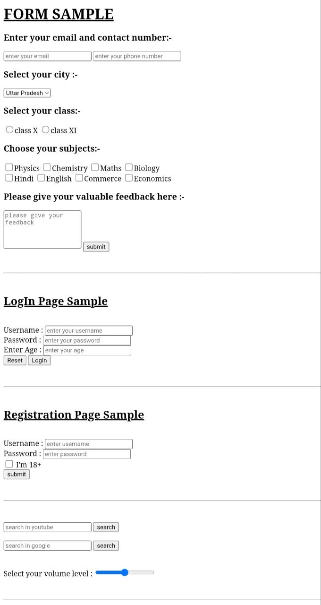
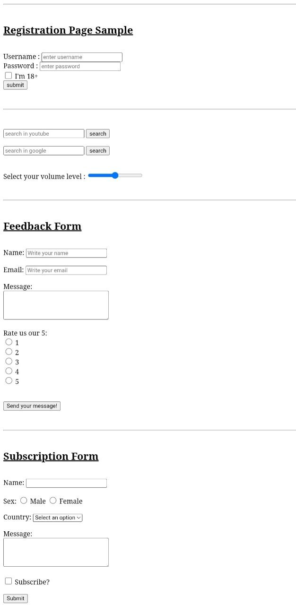

# HTML Forms Showcase 🚀

A beginner-friendly HTML project that demonstrates different types of HTML forms and input controls. This project was created to practice HTML form elements and improve my web development skills.

---

## 📖 Project Overview

This project contains multiple HTML forms such as Contact Form, Login Form, Registration Form, Feedback Form, and Subscription Form. It also includes different HTML input elements like text fields, email fields, password fields, search bars, dropdown menus, radio buttons, checkboxes, text areas, and a volume control slider.

---

## ✨ Features

- 📝 Contact Form
- 🔐 Login Form
- 👤 Registration Form
- 💬 Feedback Form
- 📧 Subscription Form
- 🔍 YouTube Search Bar
- 🌐 Google Search Bar
- 🔊 Volume Control Slider
- 📍 Dropdown Menus
- 🔘 Radio Buttons
- ☑️ Checkboxes
- ✍️ Text Areas
- 📥 Text, Email, Password & Number Input Fields
- 📱 Beginner-Friendly Design

---

## 🛠️ Technologies Used

- HTML5

---

## 📂 Project Structure

html-forms-showcase/
│── index.html
│── README.md
│── formScreenshot1.jpg
└── formScreenshot2.jpg
---

## 📸 Project Screenshots

### Screenshot 1

### Screenshot 2

---

## 🎯 What I Learned

While building this project, I learned:

- Creating different HTML forms
- Using HTML input types
- Working with labels and placeholders
- Creating dropdown menus
- Using radio buttons and checkboxes
- Creating search bars
- Creating a volume control slider
- Organizing multiple forms on a single webpage

---

## 🚀 Future Improvements

- Add CSS styling
- Make the project responsive
- Add JavaScript form validation
- Improve the user interface

---

## 👩‍💻 Author

Vaniya

GitHub: https://github.com/vaniya097

---

⭐ If you like this project, don't forget to give it a star!
